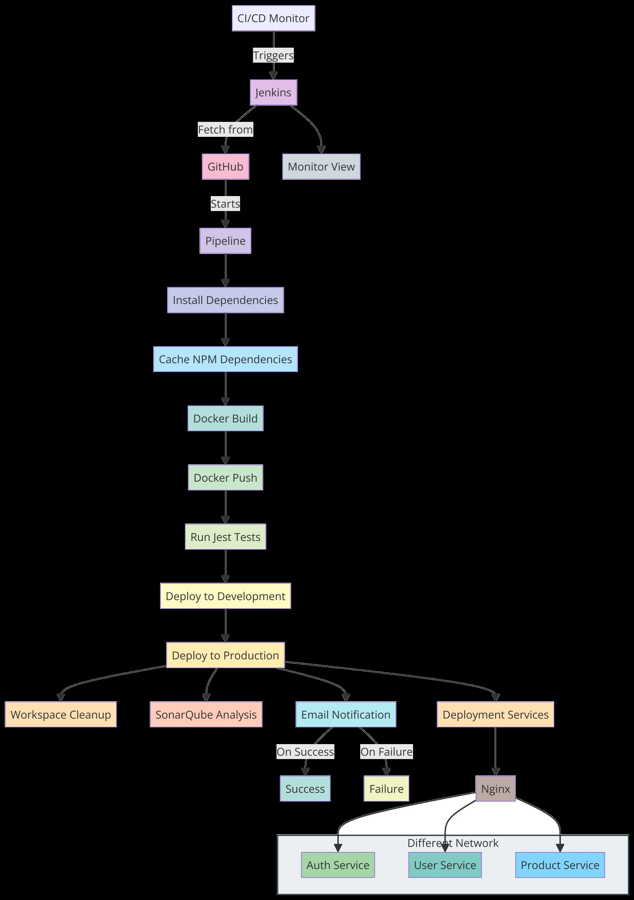

## Distributed Microservices Architecture with CI/CD Pipeline

This repository demonstrates a robust implementation of a distributed microservices architecture, utilizing Docker and Docker Compose for orchestrating services, alongside Jenkins for Continuous Integration and Continuous Deployment (CI/CD). It features an Nginx reverse proxy to efficiently route requests across three core services: auth-service, user-service, and product-service.

## Table of Contents

- [Project Structure](#project-structure)
- [Services Overview](#services-overview)
- [CI/CD Pipeline with Jenkins](#cicd-pipeline-with-jenkins)
- [ CI/CD Diagram](#cicd-diagram)
- [Deployment Process](#deployment-process)
- [Nginx Configuration](#nginx-configuration)
- [Testing](#testing)
- [SonarQube Integration](#sonarqube-integration)
- [Setting Up the Project from Scratch](#setting-up-the-project-from-scratch)
  - [Setting Up Jenkins](#setting-up-jenkins)
  - [Setting Up Docker and Docker Compose](#setting-up-docker-and-docker-compose)
  - [Setting Up SonarQube Container](#setting-up-sonarqube-container)
  - [Setting Up NPM and Project Dependencies](#setting-up-npm-and-project-dependencies)
  - [Basic Git Setup](#basic-git-setup)
- [Accessing the Application](#accessing-the-application)

## project-structure

The project is structured as follows to ensure modularity and ease of maintenance:

"""

├── auth-service/ # Handles authentication and authorization

├── user-service/ # Manages user profiles and data

├── product-service/ # Provides product catalog information

├── nginx/ # Nginx reverse proxy configuration

├── docker-compose.yaml # Docker Compose file for local development

├── docker-compose.override.yml # Overrides for Docker Compose

├── docker-compose.prod.yaml # Docker Compose file for production deployment

├── Dockerfile # Dockerfile for building services

├── Jenkinsfile # Jenkins pipeline definition

├── sonar-project.properties # SonarQube configuration

├── package.json # Node.js dependencies and scripts

├── package-lock.json # Locked versions of Node.js dependencies

├── app.js # Entry point for a mock service

├── app.test.js # Integration tests

└── entrypoint.sh # Custom entrypoint script for Docker    
"""

## Services Overview

Auth Service: Manages authentication and authorization processes.
User Service: Handles user profile and data management functionalities.
Product Service: Provides access to product catalog information.
Each service is developed with Node.js and Express.js, and containerized for scalable deployment.

## CI/CD Pipeline with Jenkins

Our CI/CD pipeline, defined in Jenkinsfile, automates the process of testing, building, and deploying the services. Key stages include:

Checkout: Cloning the source code repository.

Install Dependencies: Installing required Node.js dependencies.
Run Jest Tests: Executing integration tests to ensure quality.
Docker Build and Push: Building Docker images and pushing them to a registry.
Deploy to Development: Automated deployment to the development environment.
Deploy to Production: Zero-downtime deployment to production using rolling updates.
SonarQube Analysis: Conducting code quality and security scans.

## CI/CD Diagram

## Deployment Process
Deployments are automated via Jenkins, with manual steps provided for development and production environments:

Development Deployment:     
  docker-compose up -d

Production Deployment:
  docker-compose -f docker-compose.yaml -f docker-compose.prod.yaml up -d --no-deps --build --force-recreate

## Nginx Configuration

The nginx/ directory contains configurations to route traffic to services, acting as a reverse proxy.

## Testing

Integration testing is facilitated through Jest:
  npm run test

## SonarQube Integration

Continuous code quality and security assessments are performed via SonarQube, with configurations specified in sonar-project.properties.

## Setting Up the Project from Scratch

To get started with this project on an Ubuntu server (e.g., an AWS EC2 instance), follow these steps to install and configure Jenkins, Docker, Docker Compose, SonarQube, NPM, and Git.

### Setting Up Jenkins

Update your package manage

    sudo apt update
    
    Install Java (Jenkins requires Java to run):
    
    sudo apt install openjdk-11-jdk -y
    
    Add the Jenkins repository and key:
    
    wget -q -O - https://pkg.jenkins.io/debian/jenkins.io.key | sudo apt-key add -
    echo "deb https://pkg.jenkins.io/debian-stable binary/" | sudo tee /etc/apt/sources.list.d/jenkins.list

Install Jenkins:

    sudo apt update
    
    sudo apt install jenkins -y

Start Jenkins:

    sudo systemctl start jenkins

Enable Jenkins to run at boot:

    sudo systemctl enable jenkins

Access Jenkins:

Navigate to http://your_server_ip_or_domain:8080.

Follow the instructions to complete the installation.

### Setting Up Docker and Docker Compose

Install Docker:

    sudo apt update
  
    sudo apt install apt-transport-https ca-certificates curl software-properties-common -y
  
    curl -fsSL https://download.docker.com/linux/ubuntu/gpg | sudo apt-key add -

    sudo add-apt-repository "deb [arch=amd64] https://download.docker.com/linux/ubuntu $(lsb_release -cs) stable"
  
    sudo apt update
  
    sudo apt install docker-ce -y

Install Docker Compose:

Check the latest release of Docker Compose on its GitHub releases page.

Replace 1.29.2 with the latest version in the command below:

    sudo curl -L "https://github.com/docker/compose/releases/download/1.29.2/docker-compose-$(uname -s)-$(uname -m)" -o /usr/local/bin/docker-compose
  
    sudo chmod +x /usr/local/bin/docker-compose

### Setting Up SonarQube Container

Run SonarQube as a Docker container:

    sudo docker run -d --name sonarqube -p 9000:9000 sonarqube

Access SonarQube at http://your_server_ip_or_domain:9000.

### Setting Up NPM and Project Dependencies

Install Node.js and NPM:

    sudo apt update
  
    sudo apt install nodejs npm -y

Install project dependencies:

Navigate to your project directory:

    cd path/to/your/project

Install dependencies specified in package.json:

    npm install

### Basic Git Setup

Install Git:

    sudo apt install git -y

Configure Git (replace with your details):

      git config --global user.name "Your Name"
    
      git config --global user.email "youremail@example.com"

Clone your project (replace URL with your repository URL):

      git clone https://github.com/sabayneh1/docker-Distributed-System-with-Microservices-Architecture.git

## Accessing the Application

Access the services through the Nginx reverse proxy by navigating to your domain or public IP:

/auth/ routes to the auth-service.

/users/ routes to the user-service.

/products/ routes to the product-service.

This comprehensive setup guide ensures that all prerequisites for running the distributed microservices architecture project are met, providing a smooth start for developers and stakeholders.

